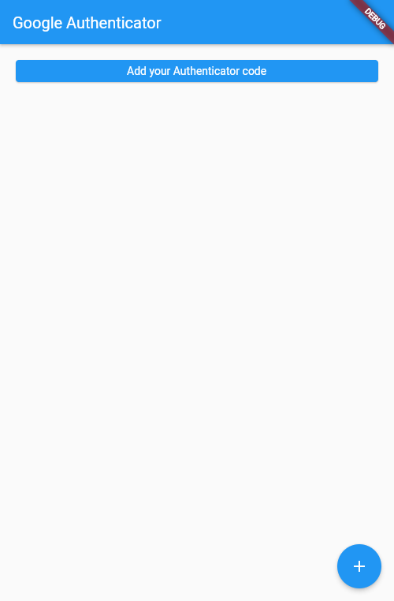
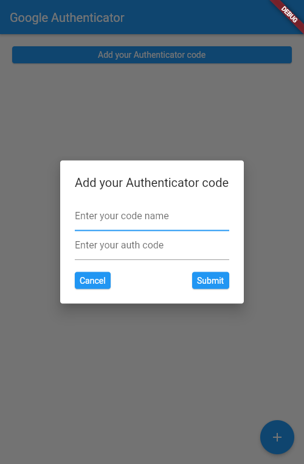
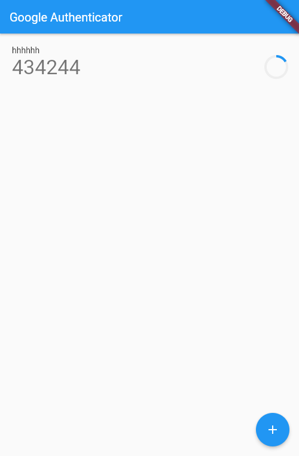
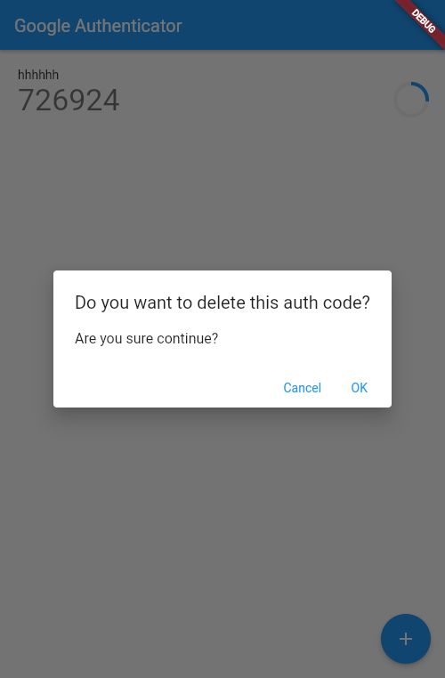

# flutter_google_authenticator

A Google Authenticator developed with flutter.

## Features

### Main interface

### Add CODE

### Token display

### Click to copy the token, long press to delete the token
